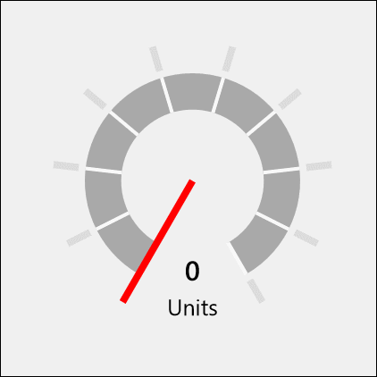

# DataGrid XAML Control

The **DataGrid Control** displays data in columns and rows.

## How it works

The DataGrid supports ... 

## Syntax

```xaml
<controls:DataGrid x:Name="DataGridControl"
	Column="1">
</controls:DataGrid>
```

## Example Image



## Example Code

[DataGrid Sample Page](https://github.com/Microsoft/UWPCommunityToolkit/tree/master/Microsoft.Toolkit.Uwp.SampleApp/SamplePages/DataGrid)

## Default Template 

[DataGrid XAML File](https://github.com/Microsoft/UWPCommunityToolkit/blob/master/Microsoft.Toolkit.Uwp.UI.Controls.DataGrid/DataGrid/DataGrid.xaml) is the XAML template used in the toolkit for the default styling.

## Requirements (Windows 10 Device Family)

| [Device family](http://go.microsoft.com/fwlink/p/?LinkID=526370) | Universal, 10.0.14393.0 or higher |
| --- | --- |
| Namespace | Microsoft.Toolkit.Uwp.UI.Controls |

## API

* [DataGrid source code](https://github.com/Microsoft/UWPCommunityToolkit/tree/master/Microsoft.Toolkit.Uwp.UI.Controls.DataGrid/DataGrid)

